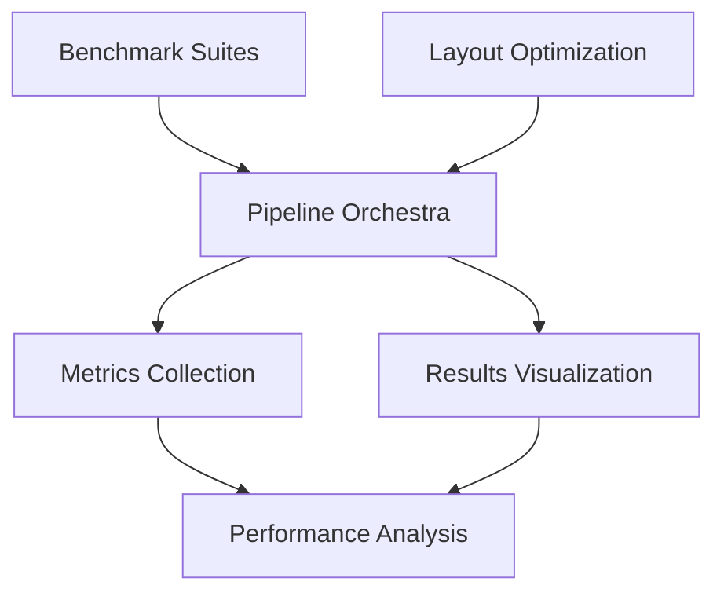

# Technical Specifications

## 🎯 Project Requirements

### Performance Targets
| Metric | Target | Baseline | Status |
|--------|--------|----------|---------|
| CX Gate Reduction | ≥25% | Qiskit opt_level=3 | 🚧 In Progress |
| Compilation Time | ≤2s | 100-qubit circuit | 🚧 In Progress |
| Circuit Range | 15-100 qubits | Variable sizes | ✅ Supported |
| Success Rate | >90% | All test circuits | 🚧 In Progress |

### Target Backend
- **Primary**: IBM Brisbane (127 qubits, Heavy-Hex topology)
- **Compatibility**: All IBM Heavy-Hex backends (Perth, Sherbrooke, etc.)
- **Topology Features**: 7-qubit hex clusters, 4-qubit kites, degree-2/3 mix

## ��️ System Architecture

### Component Dependencies


### Data Flow
1. **Circuit Generation**: Benchmark suites create test circuits
2. **Transpilation**: Pipeline runs custom vs stock comparison
3. **Metrics Collection**: Results aggregated and analyzed
4. **Visualization**: Performance plots and reports generated

## 🔬 Algorithm Specifications

### Community Detection Layout (Primary Algorithm)

#### Input Requirements
- **Circuit Format**: Qiskit DAGCircuit
- **Backend**: IBM Heavy-Hex coupling map
- **Parameters**: Random seed, optimization level

#### Algorithm Steps
```python
def community_detection_layout(dag, backend):
    # Step 1: Build interaction graph
    graph = build_interaction_graph(dag)
    
    # Step 2: Detect communities
    communities = greedy_modularity_communities(graph)
    
    # Step 3: Enumerate Heavy-Hex cells
    hex_cells = find_hex_clusters(backend.coupling_map)
    kite_cells = find_kite_structures(backend.coupling_map)
    
    # Step 4: Optimal assignment
    layout = assign_communities_to_cells(communities, hex_cells + kite_cells)
    
    return layout
```

#### Complexity Analysis
- **Time Complexity**: O(n² + m log m) where n=qubits, m=gates
- **Space Complexity**: O(n²) for distance matrices
- **Scalability**: Linear scaling up to 127 qubits (Brisbane limit)

### Simple Greedy Layout (MVP Algorithm)

#### Algorithm Logic
1. **Rank Logical Qubits**: By 2-qubit gate interaction count
2. **Rank Physical Qubits**: By error rates (readout + gate errors)
3. **Greedy Assignment**: Best logical → best available physical

#### Performance Characteristics
- **Time Complexity**: O(n log n) - fast sorting-based
- **Implementation Time**: <30 minutes
- **Expected Improvement**: 10-20% CX reduction

## 📊 Benchmark Specifications

### Quantum Volume Circuits

#### Generation Parameters
```python
QV_CONFIGS = {
    'small': {'qubits': [15, 20, 25], 'depth': 'equal_to_width'},
    'medium': {'qubits': [30, 40, 50], 'depth': 'equal_to_width'},  
    'large': {'qubits': [60, 75, 100], 'depth': 'equal_to_width'},
}
```

#### Circuit Characteristics
- **Structure**: Square (width = depth)
- **Gate Distribution**: ~50% 2-qubit gates (CX/ECR)
- **Connectivity**: Random pairwise interactions
- **Reproducibility**: Fixed seed for consistent results

### Application Circuit Suite

#### QAOA (Quantum Approximate Optimization Algorithm)
- **Parameters**: p=2 layers, random problem instances
- **Size Range**: 15-50 qubits (computational limit)
- **Gate Pattern**: ZZ rotations + X mixer rotations

#### VQE (Variational Quantum Eigensolver)
- **Ansatz**: Hardware-efficient two-local
- **Entanglement**: Linear coupling structure
- **Depth**: 2-4 repetitions based on circuit size

#### QFT (Quantum Fourier Transform)
- **Standard QFT**: Full connectivity (n² gates)
- **Approximate QFT**: Linear depth approximation
- **Size Scaling**: Up to 50 qubits for exact, 100+ for approximate

## 🛠️ Development Specifications

### Code Quality Requirements
- **Style**: PEP 8 compliance with 120-character line limit
- **Documentation**: Comprehensive docstrings for all public methods
- **Type Hints**: Full type annotation for better IDE support
- **Testing**: Unit tests for critical algorithm components

### Performance Requirements
```python
PERFORMANCE_SPECS = {
    'transpilation_timeout': 30,  # seconds per circuit
    'memory_limit': '8GB',        # maximum RAM usage
    'concurrent_circuits': 4,     # parallel processing limit
    'result_cache_size': '1GB',   # maximum cache storage
}
```

### Error Handling
- **Graceful Degradation**: Fall back to stock transpilation on failure
- **Comprehensive Logging**: All operations logged with timestamps
- **Result Validation**: Verify transpiled circuits maintain functionality

## 📈 Metrics and Evaluation

### Primary Performance Metrics

#### Gate Count Metrics
```python
GATE_METRICS = {
    'cx_count': 'Count of 2-qubit gates (CX, ECR, etc.)',
    'single_qubit_count': 'Count of 1-qubit gates',
    'total_gates': 'Sum of all gates',
    'gate_depth': 'Critical path length'
}
```

#### Quality Metrics
```python
QUALITY_METRICS = {
    'error_weighted_cost': 'Gates weighted by hardware error rates',
    'fidelity_estimate': 'Estimated circuit execution fidelity',
    'swap_overhead': 'Additional SWAP gates required',
    'layout_efficiency': 'Fraction of optimal layout achieved'
}
```

#### Compilation Metrics
```python
COMPILATION_METRICS = {
    'compile_time': 'Total transpilation duration',
    'layout_time': 'Time spent on layout optimization',
    'routing_time': 'Time spent on SWAP insertion',
    'memory_usage': 'Peak memory consumption'
}
```

### Success Criteria Definition

#### Tier 1 Success (MVP)
- ✅ Working end-to-end pipeline
- ✅ Comparison with stock Qiskit
- ✅ Measurable improvement on any circuit size
- ✅ Complete visualization and reporting

#### Tier 2 Success (Target)
- �� ≥25% CX reduction on 50+ qubit QV circuits
- 🎯 ≤2s compilation time for 100-qubit circuits
- 🎯 Consistent improvement across all benchmark suites
- 🎯 Heavy-Hex structure exploitation demonstrated

#### Tier 3 Success (Stretch)
- 🚀 >40% CX reduction on large circuits
- 🚀 Sub-second compilation for medium circuits
- 🚀 Integration with quantum error correction codes
- 🚀 Publication-quality results and analysis

## 🧪 Testing Strategy

### Unit Testing
```python
TEST_COVERAGE = {
    'layout_algorithms': ['correctness', 'performance', 'edge_cases'],
    'benchmark_generation': ['circuit_validity', 'size_scaling', 'reproducibility'],
    'pipeline_orchestration': ['error_handling', 'result_consistency', 'timeout_handling'],
    'metrics_collection': ['data_integrity', 'statistical_validity', 'export_formats']
}
```

### Integration Testing
- **End-to-End Pipeline**: Full workflow from circuit generation to results
- **Backend Compatibility**: Testing across different IBM backends
- **Scale Testing**: Performance validation up to maximum circuit sizes

### Performance Benchmarking
- **Baseline Comparison**: Systematic comparison with Qiskit opt_level 0-3
- **Scaling Analysis**: Performance trends across circuit sizes
- **Statistical Validation**: Multiple runs with confidence intervals

## 🎯 Hackathon Timeline

### Phase 1: Foundation (Hours 0-4)
- [x] Project architecture and directory structure
- [x] Abstract base classes and interfaces
- [x] Basic benchmark suite implementation
- [x] Pipeline orchestration framework

### Phase 2: Algorithm Implementation (Hours 4-8)
- [ ] Simple greedy layout algorithm (MVP)
- [ ] Basic pipeline integration and testing
- [ ] Initial performance validation
- [ ] Visualization and reporting setup

### Phase 3: Optimization (Hours 8-12)
- [ ] Community detection implementation
- [ ] Heavy-Hex structure analysis
- [ ] Performance tuning and optimization
- [ ] Comprehensive benchmark execution

### Phase 4: Analysis and Presentation (Hours 12-16)
- [ ] Statistical analysis and validation
- [ ] Visualization polish and export
- [ ] Documentation and presentation materials
- [ ] Final performance validation

## 📋 Dependencies and Requirements

### Core Dependencies
```python
CORE_REQUIREMENTS = {
    'qiskit': '>=1.0.0',           # Quantum computing framework
    'qiskit-ibm-runtime': '>=0.21.0',  # IBM backend access
    'networkx': '>=3.2',          # Graph algorithms
    'numpy': '>=1.24.0',          # Numerical computing
    'scipy': '>=1.10.0',          # Scientific computing
}
```

### Analysis Dependencies
```python
ANALYSIS_REQUIREMENTS = {
    'pandas': '>=2.0.0',          # Data manipulation
    'matplotlib': '>=3.7.0',     # Plotting
    'seaborn': '>=0.12.0',       # Statistical visualization
    'jupyter': '>=1.0.0',        # Notebook environment
}
```

### Optional Performance Dependencies
```python
OPTIONAL_REQUIREMENTS = {
    'numba': '>=0.57.0',         # JIT compilation for speed
    'multiprocessing': 'stdlib',  # Parallel processing
    'tqdm': '>=4.65.0',          # Progress bars
}
```

---

*Technical specifications are subject to updates based on development progress and hackathon constraints.*
